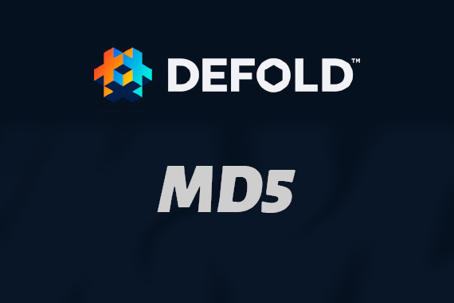

# Defold-MD5

Defold-MD5 [Native Extension](https://www.defold.com/manuals/extensions/) for the [Defold Game Engine](https://www.defold.com) 

This Extension allows you calculate MD5 in native from string

## Platforms

* **iOS**
* **Android**
* **MacOS**
* **Windows**

## Setup

You can use the Defold-MD5 extension in your own project by adding this project as a [Defold library dependency](https://www.defold.com/manuals/libraries/). Open your game.project file and in the dependencies field under project add:

> https://github.com/Melsoft-Games/defold-md5/archive/master.zip

Or point to the ZIP file of a [specific release](https://github.com/Melsoft-Games/defold-md5/releases).

## API

#### `MD5.calculate(string)`
return MD5 hash from string

## License, Authors
*MIT license*
This NE wrapped by [Denis Smirnov](https://github.com/trouble1337)

Original module from: [MD5](https://github.com/grobian/carbon-c-relay)
[License](https://github.com/grobian/carbon-c-relay/blob/master/LICENSE.md)

## Issues and suggestions

If you have any issues, questions or suggestions please [create an issue](https://github.com/Melsoft-Games/defold-md5/issues) or contact me: insality@gmail.com
